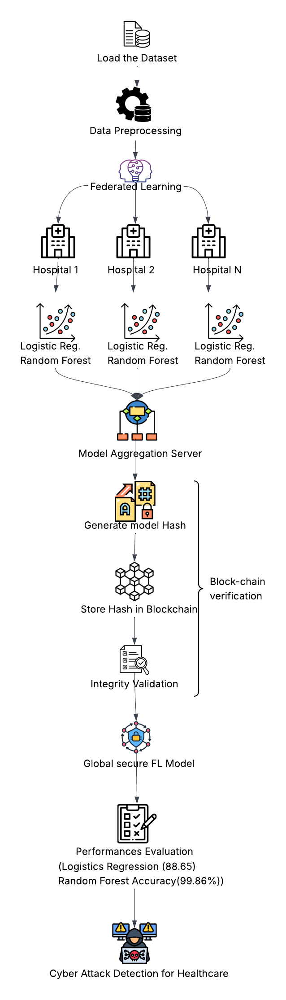
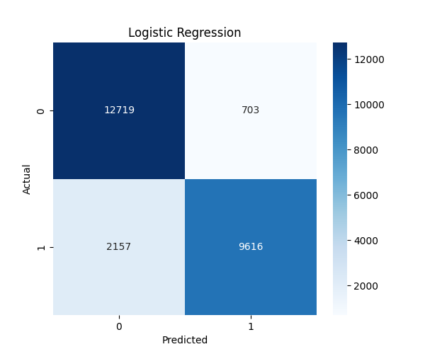
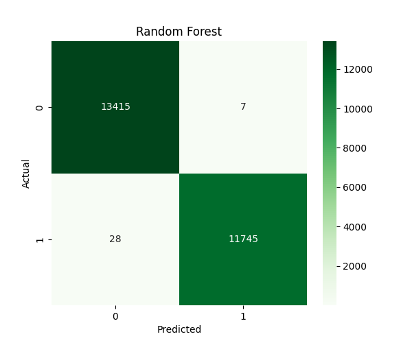
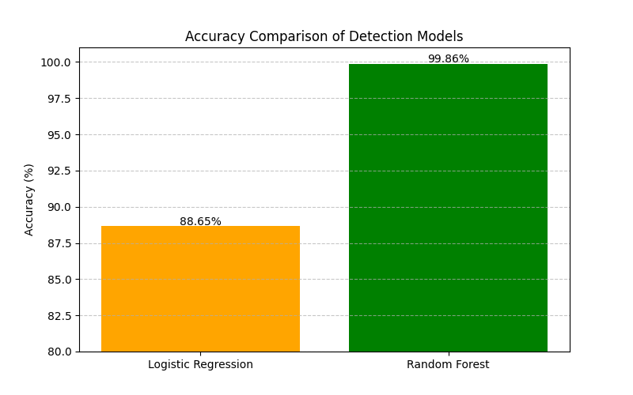

# 🏥 SecureMedFL-Service

## Blockchain-Based Federated Learning Framework for Cyber Attack Detection and Classification in Secure Healthcare Systems

### 📌 Project Overview

SecureMedFL-Service is a cybersecurity framework designed for healthcare environments that combines:

* Federated Learning (FL)
* Blockchain Technology
* Machine Learning-based Intrusion Detection

The framework enables multiple healthcare organizations to collaboratively train machine learning models without sharing sensitive patient data. Blockchain is used to ensure model integrity and transparency.

---

## 🚀 Features

✅ Privacy-Preserving Federated Learning

✅ Blockchain-based Model Verification

✅ Cyber Attack Detection using Machine Learning

✅ Comparative Analysis of Multiple Models

✅ Healthcare Data Security Enhancement

✅ Model Integrity Validation using SHA-256 Hashing

---

## 🏗 System Architecture



---

## 📂 Project Structure

```text
SecureMedFL-Service/
│
├── dataset/
│   └── KDDTrain+.txt
│
├── src/
│   ├── preprocess.py
│   ├── model_1.py
│   ├── model_2.py
│   ├── federated.py
│   └── blockchain.py
│
├── images/
│   ├── architecture.png
│   ├── accuracy_comparison.png
│   ├── confusion_matrix_lr.png
│   └── confusion_matrix_rf.png
│
├── main.py
├── requirements.txt
└── README.md
```

---

## 🧠 Machine Learning Models

### Logistic Regression

* Accuracy: **88.65%**
* Used as baseline model

### Random Forest

* Accuracy: **99.86%**
* Best performing model

---


## 🔗 Federated Learning Workflow

1. Data is preprocessed.
2. Dataset is divided among multiple clients.
3. Local models are trained independently.
4. Models are aggregated at the server.
5. Blockchain stores model hashes.
6. Global model is generated.
7. Performance evaluation is performed.

---

## 🔒 Blockchain Integration

The project uses SHA-256 hashing to create immutable records of trained models.

### Benefits

* Tamper Detection
* Integrity Verification
* Transparent Audit Trail
* Secure Model Sharing

---

## 📚 Dataset

Dataset Used:

**NSL-KDD Dataset**

The NSL-KDD dataset is a benchmark dataset widely used for intrusion detection system research.

Features:

* Normal Traffic
* Attack Traffic

Attack Categories:

* DoS
* Probe
* R2L
* U2R

---

## 🛠 Technologies Used

* Python
* Scikit-Learn
* Pandas
* NumPy
* Matplotlib
* Seaborn
* Blockchain (SHA-256)
* Federated Learning

---

## ⚙ Installation

Clone the repository:

```bash
git clone https://github.com/Anishaforyou/SecureMedFL_Service.git
```

Move into project folder:

```bash
cd SecureMedFL_Service
```

Install dependencies:

```bash
pip install -r requirements.txt
```

Run the project:

```bash
python main.py
```

---

## 📊 Experimental Results

### Logistic Regression Performance

Accuracy: **88.65%**

#### Logistic Regression Confusion Matrix

<p align="center">
  
</p>

---

### Random Forest Performance

Accuracy: **99.86%**

#### Random Forest Confusion Matrix

<p align="center">
  
</p>

---

### Accuracy Comparison

<p align="center">
  
</p>

| Model               | Accuracy |
| ------------------- | -------- |
| Logistic Regression | 88.65%   |
| Random Forest       | 99.86%   |

### Observation

* Logistic Regression achieved an accuracy of **88.65%**.
* Random Forest achieved an accuracy of **99.86%**.
* Random Forest outperformed Logistic Regression by approximately **11.21%**.
* The results indicate that Random Forest is more effective at capturing complex attack patterns in network traffic data.


### Conclusion

Random Forest significantly outperformed Logistic Regression in cyber attack detection, demonstrating its ability to capture complex attack patterns present in network traffic data.

---

## 👩‍💻 Authors

**Anisha Kundu**

B.Tech, Information Technology

Dr. B.C. Roy Engineering College

<br>

**Sreyashi Saha**

B.Tech, Information Technology

Dr. B.C. Roy Engineering College


---

## 📄 License

This project is developed for academic and research purposes.
